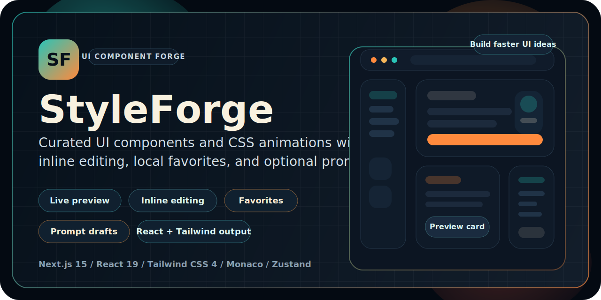

# 🎨 StyleForge


StyleForge is a Next.js UI component library and CSS animation vault built for discovering, previewing, editing, saving, and generating reusable interface patterns.

> ✨ Use it as a UI inspiration board, a live component playground, or a starting point for shipping cleaner frontend ideas faster.

## 👀 At a Glance

- 🔎 Browse a curated catalog of UI components and motion snippets
- ⚡ Preview components live before copying or editing code
- 🧩 Edit HTML, CSS, JavaScript, and React output directly in the browser
- ❤️ Save favorites and custom components with local persistence
- 🔁 Convert HTML and CSS into React + Tailwind output
- 🤖 Use optional prompt-based generation powered by Gemini

> ✅ The component library works without an API key. Add `GEMINI_API_KEY` only if you want prompt generation and conversion features.

## ✨ Core Features

| Feature | What it does |
| --- | --- |
| Live previews | Render components instantly before copying them into your project. |
| Inline editing | Update HTML, CSS, JavaScript, and React code directly in the UI. |
| Favorites and persistence | Keep preferred components saved locally with Zustand. |
| Prompt generation | Generate fresh component drafts from natural language prompts. |
| React + Tailwind conversion | Turn HTML and CSS into React-friendly Tailwind output. |

## 🛠️ Tech Stack

| Layer | Tools |
| --- | --- |
| Framework | Next.js 15 App Router |
| UI | React 19 |
| Styling | Tailwind CSS 4 |
| Editing | Monaco Editor |
| State | Zustand |
| Optional AI | Google Gemini via `@google/genai` |

## 🚀 Quick Start

### Prerequisites

- Node.js 20+
- npm

### Installation

1. Install dependencies.

   ```bash
   npm install
   ```

2. Create `.env.local` from `.env.example` if you want prompt-based generation and conversion.

   ```env
   GEMINI_API_KEY="your_gemini_api_key"
   ```

3. Start the development server.

   ```bash
   npm run dev
   ```

4. Open `http://localhost:3000` in your browser.

## 🔐 Environment Variables

| Variable | Required | Description |
| --- | --- | --- |
| `GEMINI_API_KEY` | No | Enables prompt-based generation and HTML/CSS-to-React conversion. |

## 📜 Available Scripts

| Command | Description |
| --- | --- |
| `npm run dev` | Start the local development server |
| `npm run build` | Create a production build |
| `npm run start` | Serve the production build |
| `npm run lint` | Run ESLint and project validation |
| `npm run clean` | Remove the local `.next` build output |

## 📁 Project Structure

```text
app/                App Router pages and optional generation route
components/         Reusable UI building blocks
data/               Seeded component library data
hooks/              Client-side hooks
lib/                Shared utilities
store/              Zustand store for persistence and filters
types/              Shared types and category definitions
```

## 📦 Publishing Notes

- Keep `.env.local` out of version control
- Run `npm run lint` before publishing changes
- Run `npm run build` before shipping production updates
- Prompt requests are handled server-side, so the API key stays off the client
- Update your repository description, topics, and social preview for better GitHub visibility

## 📄 License

This project is licensed under the Apache 2.0 License.
